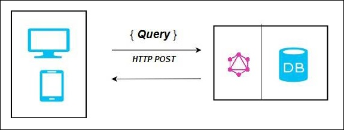
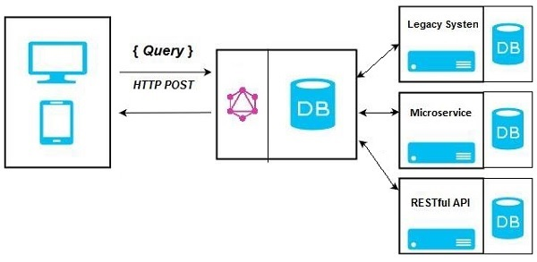
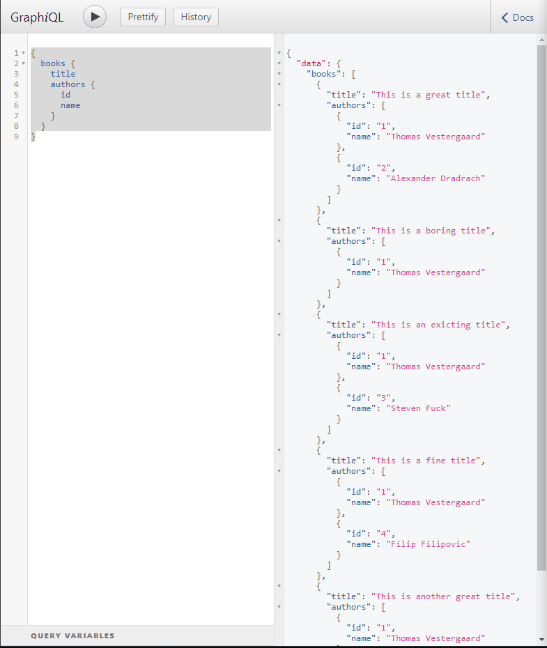
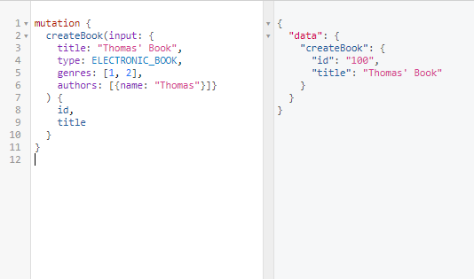

# Period-4 GraphQL

### Explain shortly about GraphQL, its purpose and some of its use cases

> GraphQL is a query language for your API, and a server-side runtime for executing queries by using a type system you define for your data. GraphQL isn't tied to any specific database or storage engine and is instead backed by your existing code and data.

Using GraphQL, we define a schema consisting of our types that can be retrieved, and the queries and mutations that can be executed. The client can then execute the defined GraphQL queries and mutations, using a HTTP post request. Queries **should** not modify data on the server, while **Mutations** shoul.

The main difference between REST and GraphQL is the number of endpoints exposed by a server. GraphQL only exposes one endpoint that can be used to execute all defined queries and mutations, whereas REST apis have a one-to-one relationship between endpoints and queries. While REST focuses on CRUD operations on *Resources*, GraphQL queries and mutations are much more like function calls.

- GraphQL endpoints only use `POST` requests, while REST endpoints use `POST`, `GET`, `PUT` and `DELETE`.
- GraphQL endpoints accept and return `application/json`.

### Explain some of the Server Architectures that can be implemented with a GraphQL backend.

- https://www.tutorialspoint.com/graphql/graphql_architecture.htm

> GraphQL is a specification that describes the behavior of a GraphQL server. It is a set of guidelines on how requests and responses should be handled like supported protocols, format of the data that can be accepted by the server, format of the response returned by the server, etc. The request made by a client to the GraphQL server is called a Query. Another important concept of GraphQL is its transport layer agnostics. It can be used with any available network protocol like TCP, websocket or any other transport layer protocol. It is also neutral to databases, so you can use it with relational or NoSQL databases.

Like REST, GraphQL is  used to create APIs over HTTP. The GraphQL endpoints hide the implementation of the operations and data storage method.





This means that you can change the implementation of the endpoint, and still have the same interface.

### What is meant by the terms over- and under-fetching in relation to REST.

>Over-fetching is fetching too much data, aka there is data in the reponse you don't use.
>
>Under-fetching is not having enough data with a call to an endpoint, leading you to call a second endpoint.
>
>In both cases, they are performances issues : you either use more bandwidth than you should, or you are making more HTTP requests that you should.
>
>In a perfect world, theses problems would never arise ; you would have exactly the right endpoints to give exactly the right data to your products.
>
>These problems often appear when you scale and iterate on your products. The data you use on your pages often change, and the cost to maintain a separate endpoint with exactly the right data for each component becomes too much.
>
>So you end up with a compromise between not having too much endpoints and having the endpoints fit the need best. This will lead to over-fetching in some cases (the endpoint will provide more data that you need for your specific component), and under-fetching in others (you will need to call a second endpoint).
>
>So GraphQL fixes this problem because it allows access to an arbitrary set of data exposed by the server. You specifically specify what you need and will get this data, and only this data, in one trip to the server.
- https://stackoverflow.com/questions/44564905/what-is-over-fetching-or-under-fetching

GraphQL fixes this by requiring the fields that must be retrieved from the server. The server therefor does not need to transfer unnecessary fields when making requests.

```
{
  books {
    title
    authors {
      id 
      name
    }
  }
}
```

Above we specify that the books should contain the `title` and `authors` field, but no other fields. The same technique is used to limit the fields on the `Author` entity. This information is sent when making the request.

The `graphql` package automatically removes any fields not specifies on the returned type.

### Explain shortly about GraphQL’s type system and some of the benefits we get from this.

- https://graphql.org/learn/schema/

The schema defines the data-types that can be retrieved from the datastore. The schema also contains the queries that can be performed by the client. The schema is created using the `GraphQL schema language`.

### Explain shortly about GraphQL Schema Definition Language, and provide a number of examples of schemas you have defined.

The GraphQL Schema Definition Language is the language used to define the schema of the GrqphQL endpoint. The schema contains the types that can be accepted and returned, and queries and mutations that the client can execute. Importantly, the schema definition language is independant from the server side programming language, although you can also choose define the schema using native javascript.

```
type Author {
    id: ID!
    name: String!
}

enum BookType {
    ELECTRONIC_BOOK
    PAPER_BOOK
}

type Genre {
    id: ID!
    name: String!
}

type Book {
    id: ID!
    title: String!
    type: BookType!
    genre: [Genre]!
    authors: [Author]!
}

type Query {
    books(n: Int=20, start: Int=0): [Book]!
    authors(n: Int=20, start: Int=0): [Author]!
    genres: [Genre]! 
}
```

In the above example we define the `Book`, `Author` and `Genre` types. These are like the resources we would return using REST APIs. Within the curly brackets we define the fields present on the type. Outside, user-defined types, GraphQL also has a number of built-in types like `ID`, `String`, `Int`, `Float`, `Boolean` and array type (`[T]`). These types are all nullable by default, unless you prepend an exclamation point (`!`).

Within the schema we also define the queries and mutations that clients can execute.

```
type Query {
    books(n: Int=20, start: Int=0): [Book!]!
    authors(n: Int=20, start: Int=0): [Author!]!
    genres: [Genre]! 
}

```

Here we define three queries: `books`, `authors` and `genres`. We also declare the parameters the queries accept, and *optionally* with their default values. The return type is also specified.

### Provide a number of examples demonstrating data fetching with GraphQL. You should provide examples both running in a Sandbox/playground and examples executed in an Apollo Client



`Query`: [BookCrud_Legacy.js](https://github.com/Thomas-Rosenkrans-Vestergaard/javascript-exam-questions/tree/master/graphql-frontend/src/BookCrud_Lagacy.js)

`client.query`: [BookCrud.js](https://github.com/Thomas-Rosenkrans-Vestergaard/javascript-exam-questions/tree/master/graphql-frontend/src/BookCrud.js).

### Provide a number of examples demonstrating creating, updating and deleting with Mutations. You should provide examples both running in a Sandbox/playground and examples executed in an Apollo Client.

- [example](http://localhost:4000/?query=mutation%20%7B%0A%20%20createBook(input%3A%20%7B%0A%20%20%20%20title%3A%20%22Thomas%27%20Book%22%2C%20%0A%20%20%20%20type%3A%20ELECTRONIC_BOOK%2C%20%0A%20%20%20%20genres%3A%20%5B1%2C%202%5D%2C%20%0A%20%20%20%20authors%3A%20%5B%7Bname%3A%20%22Thomas%22%7D%5D%7D%0A%20%20)%20%7B%0A%20%20%20%20id%2C%20%0A%20%20%20%20title%0A%20%20%7D%0A%7D%0A)



`client.query`: [BookCrud.js](https://github.com/Thomas-Rosenkrans-Vestergaard/javascript-exam-questions/tree/master/graphql-frontend/src/BookCrud.js).

### Explain the Concept of a Resolver function, and provide a number of simple example of resolvers you have implemented in a GraphQL Server.

Resolver functions are the functions that execute the operation when a query or mutation is called by a client. There is a one-to-one relationship between GraphQL queries/mutations and resolver functions.

The resolver function accepts the arguments provided by the GraphQL client. Here are the resolver functions for the above schema. These resolver functions are backend by an array of books, authors and genres.

```js
const root = {
    books: args => {
        const {n, start} = args;
        return books.slice(start, start + n);
    },
    authors: args => {
        const {n, start} = args;
        return authors.slice(start, start + n);
    },
    genres: () => {
        return genres;
    }
};
```

### Explain the benefits we get from using a library like Apollo-client, compared to using the plain fetch-API.

It's important to note that GraphQL is not a webserver or database. GraphQL defines two languages for exchanging data between a client and server: The schema definition language and the query language.

> GraphQL is an open-source data query and manipulation language for APIs, and a runtime for fulfilling queries with existing data.

Most GraphQL server implementations use HTTP POST requests to query the server and mutate data.

> If you boil it down to the basics, a GraphQL client is code that makes a POST request to a GraphQL Server. In the body of the request we send a GraphQL query or mutation as well as some variables and we expect to get some JSON back.

A GraphQL client is therefor a library that can send HTTP requests, that also help the developer to compose these queries. This includes the ability to insert variables into queries.

GraphQL clients can also help to provide a caching mechanism, to save on requests sent to the GraphQL server. Caching can help improve the feel and responsiveness of the application, since the query does not need to go to the server most of the time.

Some clients have similar interfaces to `fetch`, while others provide differing interfaces and React-specific components that help to send queries and perform mutations (GraphQL Apollo).

### In an Apollo-based React Component, demonstrate how to perform GraphQL Queries

There are two primary ways of executing queries using apollo client. One is using the `Query` component that is rendered within the `render` method of the component. The other is calling the `query` method on the `client` directory. The latter method resembles a more _normal_ `fetch`-based approach.

[BookCrud_Legacy.js](https://github.com/Thomas-Rosenkrans-Vestergaard/javascript-exam-questions/tree/master/graphql-frontend/src/BookCrud_Lagacy.js)

Above it can be seen that we provide the `Query` component with a function. This function is responsible for rendering the result of the `Query`. This approach can cause problems, especially when the query is dependent on the state of the component.

Here is an example using `client.query` instead, from 
[BookCrud.js](https://github.com/Thomas-Rosenkrans-Vestergaard/javascript-exam-questions/tree/master/graphql-frontend/src/BookCrud.js).

If we used the `Query` component here, it would update, and retrieve the results any time the state was updated. This is not what we want, since our state also contains other information, that should be able to change, without the query refiring.

### Demonstrate and highlight important parts of a “complete” GraphQL-app using Express and MongoDB on the server side, and Apollo-Client on the client.

Backend:

- [Mongoose schema declarations](https://github.com/Thomas-Rosenkrans-Vestergaard/js-mini/tree/master/src/data)
- [Logic layer](https://github.com/Thomas-Rosenkrans-Vestergaard/js-mini/tree/master/src/controllers/facades)
- [GraphQL Schema Declaration](https://github.com/Thomas-Rosenkrans-Vestergaard/js-mini/blob/master/src/controllers/graphql/schema.ts)
- [GraphQL -> TypeScript codegen](https://github.com/Thomas-Rosenkrans-Vestergaard/js-mini/blob/master/codegen.yml)
- [GraphQL Resolvers](https://github.com/Thomas-Rosenkrans-Vestergaard/js-mini/tree/master/src/controllers/graphql/resolvers)
- [GraphQL Express Router](https://github.com/Thomas-Rosenkrans-Vestergaard/js-mini/blob/master/src/controllers/graphql/router.ts)

Frontend:

- [Apollo Client Connection](https://github.com/Thomas-Rosenkrans-Vestergaard/js-mini-app/blob/master/App.js#L40)
- [Apollo Client Mutation Example](https://github.com/Thomas-Rosenkrans-Vestergaard/js-mini-app/blob/master/App.js#L66)
- [Apollo Client Query Example](https://github.com/Thomas-Rosenkrans-Vestergaard/js-mini-app/blob/master/Posts.js)